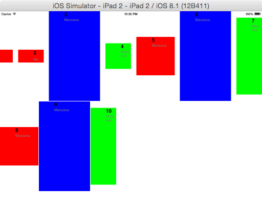
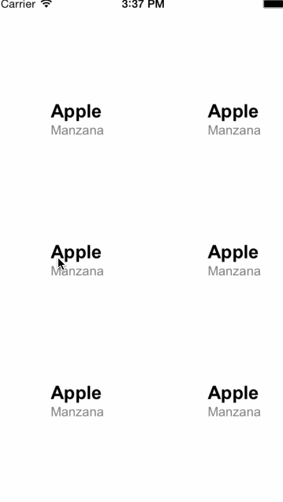

# Ti.CollectionView

[](http://gitt.io/component/ti.collectionview)
[](http://mit-license.org)
[](https://github.com/nuno/TiCollectionView/issues)

## ⚠️ IMPORTANT TO NOTE:
Since version 2.0 the module id is  ```ti.collectionview```
and NOT ```de.marcelpociot.CollectionView```

The original work was done by [Marcel Pociot](https://github.com/mpociot). He passed the module 
to me for me continue his GREAT work, he  had  not the time to continue! I will need all the help 
possible to keep that module great!

## Overview

This module allows you to use a collection / grid view with the Appcelerator Titanium SDK.

It uses the Titanium `ItemTemplate` objects for the best performance.

### Grid layout


### Waterfall layout


### Context menu


## Installation
### Get it [](http://gitt.io/component/ti.collectionview)
Download the latest distribution ZIP-file and consult the [Titanium Documentation](http://docs.appcelerator.com/titanium/latest/#!/guide/Using_a_Module) on how install it, or simply use the [gitTio CLI](http://gitt.io/cli):

`$ gittio install ti.collectionview`

### Important notes for Android
In order to make this module work for Android, you need to use the provided "[CollectionView.js](lib/CollectionView.js)" CommonJS library.

## API

This module uses the [Ti.UI.ListView API](http://docs.appcelerator.com/titanium/latest/#!/api/Titanium.UI.ListView).

## Additional parameters

The ListView API gets extended by these custom parameters:

* `layout` _(LAYOUT_WATERFALL | LAYOUT_GRID)_ - sets the layout to use for the collection view. You can select between the waterfall layout (like Pinterest) or the standard grid layout which is the default value.

### Waterfall layout specific configuration

* `columnCount` _(Number)_ The number of columns to use. Default: 3
* `minimumColumnSpacing` _(Number)_ The minimum spacing between each columns
* `minimumInteritemSpacing` _(Number)_ The minimum spacing between each items (vertically)
* `renderDirection` _(DIRECTION_LEFT_TO_RIGHT | DIRECTION_RIGHT_TO_LEFT | DIRECTION_SHORTEST_FIRST)_ The render direction to use. Default: DIRECTION_LEFT_TO_RIGHT


### iOS specific configuration (Creation Only!)
* `scrollDirection` _(SCROLL_HORIZONTAL | SCROLL_VERTICAL )_ Default: SCROLL_VERTICAL
* `showContextMenu` _Boolean_ - Should we show a contextual menu on longpress? Default: NO
* `contextMenuStrokeColor` _Color_ - The stroke color of the context Menu indicator
* `contextMenuItems` _Array_ - An array of context menu items each item is an object with the following attributes
	* `tintColor` _Color_ - The color used to tint the icon
	* `selected` _Image_ - The image for the selected state
	* `unselected` _Image_ - The image for the unselected state

#### Events
* `contextMenuClick` - Fired when a context menu item gets selected
	* `index` _Number_ - The selected menu item index
	* `itemIndex` _Number_ - The selected collection view item index
	* `sectionIndex` _Number_ - The selected collection view section index

---

### Android specific configuration

* `columnWidth` _(Number)_ - Defines the width of each column. The Android module will fit as many columns in a row as possible
* `verticalSpacing` _(Number)_ - Defines the vertical column spacing
* `horizontalSpacing` _(Number)_ - Defines the horizontal column spacing

## Usage

Alloy:
```xml
<ListView id="listView" backgroundColor="white" defaultItemTemplate="template" module="ti.collectionview" method="createCollectionView">

<Templates>
    <ItemTemplate name="template">
        <View id="container">
            <Label bindId="info" id="title" />
            <Label bindId="es_info" id="subtitle" />
        </View>
    </ItemTemplate>

</Templates>

<ListSection module="ti.collectionview" method="createCollectionSection">

    <ListItem module="ti.collectionview" method="createCollectionItem" width="150" height="200" info:text="Apple" es_info:text="Manzana" />
    <ListItem module="ti.collectionview" method="createCollectionItem" width="150" height="200" info:text="Banana" es_info:text="Banana" />
    <ListItem module="ti.collectionview" method="createCollectionItem" width="150" height="200" info:text="Apple" es_info:text="Manzana" />
    <ListItem module="ti.collectionview" method="createCollectionItem" width="150" height="200" info:text="Banana" es_info:text="Banana" />
</ListSection>
</ListView>
```

Vanilla JS:

```js
var collectionView = require("ti.collectionview");

var win = Ti.UI.createWindow({backgroundColor: 'white'});

// Create a custom template that displays an image on the left, 
// then a title next to it with a subtitle below it.
var myTemplate = {
    childTemplates: [
        {                            // Title 
            type: 'Ti.UI.Label',     // Use a label for the title 
            bindId: 'info',          // Maps to a custom info property of the item data
            properties: {            // Sets the label properties
                color: 'black',
                font: { fontFamily:'Arial', fontSize: '20dp', fontWeight:'bold' },
                left: '60dp', top: 0,
            }
        },
        {                            // Subtitle
            type: 'Ti.UI.Label',     // Use a label for the subtitle
            bindId: 'es_info',       // Maps to a custom es_info property of the item data
            properties: {            // Sets the label properties
                color: 'gray',
                font: { fontFamily:'Arial', fontSize: '14dp' },
                left: '60dp', top: '25dp',
            }
        }
    ]
};

var listView = require("ti.collectionview").createCollectionView({
    backgroundColor: "white",
    top: 0,
    left: 0,
    width: Ti.UI.FILL,
    height: Ti.UI.FILL,
    // Maps myTemplate dictionary to 'template' string
    templates: { 'template': myTemplate },
    // Use 'template', that is, the myTemplate dict created earlier
    // for all items as long as the template property is not defined for an item.
    defaultItemTemplate: 'template',
    
    // Context menu options
    showContextMenu : true,
    contextMenuStrokeColor : "red",
    contextMenuItems : [
        {
            tintColor: "red",
            selected: "/images/UploadIconSelected.png",
            unselected:"/images/UploadIcon.png",
        },
        {
            tintColor: "red",
            selected: "/images/TrashIconSelected.png",
            unselected:"/images/TrashIcon.png",
        }
    ],
    
    // ANDROID ONLY
    columnWidth: 150,
    verticalSpacing: 10,
    horizontalSpacing: 10
});
var sections = [];

var fruitSection = collectionView.createCollectionSection({ headerTitle: 'Fruits / Frutas'});
var fruitDataSet = [
    // the text property of info maps to the text property of the title label
    // the text property of es_info maps to text property of the subtitle label
    // the image property of pic maps to the image property of the image view
    { info: {text: 'Apple'}, es_info: {text: 'Manzana'}, properties: {height:150,width:150}},
    { info: {text: 'Apple'}, es_info: {text: 'Manzana'}, properties: {height:150,width:150}},
];
fruitSection.setItems(fruitDataSet);
sections.push(fruitSection);

listView.setSections(sections);
win.add(listView);
win.open();
```

	
## Changelog

All Releases are located in the **"/dist/*"** folder: https://github.com/nuno/TiCollectionView/tree/master/dist

* v2.0.0
  * _iOS only_ Move project to ARC, fix all warnings and compile errors
  * _iOS only_ Fix main-thread execution
  * _iOS only_ Rebuild with 6.0.3.GA
  * _iOS only_ Rename project to "Ti.CollectionView"
  * _iOS only_ Support for the "allowsMultipleSelection" property 
  * _iOS only_ Support for the "contentOffset" property 
  * _iOS only_ Support for the "scrollstart" and "scrollend" event 
* v1.4.1
   * _iOS only_ Fix pull-to-refresh
* v1.4.0
	* _iOS only_ Added support for horizontal scrolling
* v1.3.0
	* _iOS only_ Added support for header and footer views
* v1.2.0
	* _iOS only_ Added support for longtouch context menus
* v1.1.1
	* Added support for Pull To Refresh
* v1.1.0
	* Added waterfall layout for iOS
* v1.0.0  
  * Initial release with Android support added
  
  
## License

Copyright 2014-2015 Marcel Pociot

Permission is hereby granted, free of charge, to any person obtaining a copy of this software and associated documentation files (the "Software"), to deal in the Software without restriction, including without limitation the rights to use, copy, modify, merge, publish, distribute, sublicense, and/or sell copies of the Software, and to permit persons to whom the Software is furnished to do so, subject to the following conditions:

The above copyright notice and this permission notice shall be included in all copies or substantial portions of the Software.

THE SOFTWARE IS PROVIDED "AS IS", WITHOUT WARRANTY OF ANY KIND, EXPRESS OR IMPLIED, INCLUDING BUT NOT LIMITED TO THE WARRANTIES OF MERCHANTABILITY, FITNESS FOR A PARTICULAR PURPOSE AND NONINFRINGEMENT. IN NO EVENT SHALL THE AUTHORS OR COPYRIGHT HOLDERS BE LIABLE FOR ANY CLAIM, DAMAGES OR OTHER LIABILITY, WHETHER IN AN ACTION OF CONTRACT, TORT OR OTHERWISE, ARISING FROM, OUT OF OR IN CONNECTION WITH THE SOFTWARE OR THE USE OR OTHER DEALINGS IN THE SOFTWARE.

## Contextmenu License
Copyright 2014 Brandon McQuilkin

Permission is hereby granted, free of charge, to any person obtaining a copy of this software and associated documentation files (the "Software"), to deal in the Software without restriction, including without limitation the rights to use, copy, modify, merge, publish, distribute, sublicense, and/or sell copies of the Software, and to permit persons to whom the Software is furnished to do so, subject to the following conditions:

The above copyright notice and this permission notice shall be included in all copies or substantial portions of the Software.

THE SOFTWARE IS PROVIDED "AS IS", WITHOUT WARRANTY OF ANY KIND, EXPRESS OR IMPLIED, INCLUDING BUT NOT LIMITED TO THE WARRANTIES OF MERCHANTABILITY, FITNESS FOR A PARTICULAR PURPOSE AND NONINFRINGEMENT. IN NO EVENT SHALL THE AUTHORS OR COPYRIGHT HOLDERS BE LIABLE FOR ANY CLAIM, DAMAGES OR OTHER LIABILITY, WHETHER IN AN ACTION OF CONTRACT, TORT OR OTHERWISE, ARISING FROM, OUT OF OR IN CONNECTION WITH THE SOFTWARE OR THE USE OR OTHER DEALINGS IN THE SOFTWARE.
